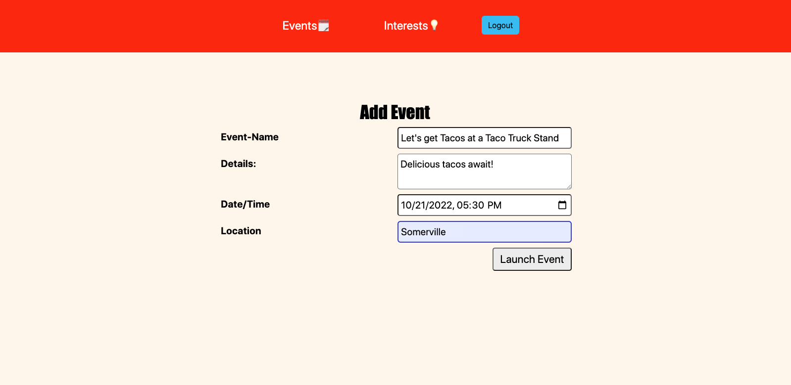
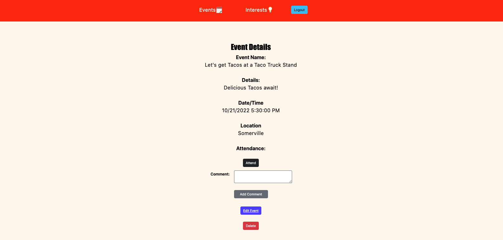

# Event-Planner!

Event Planner is an event planning website where people can create events for others to attend! Users will need to Login in order to fully use the website.

Once logged in, Users can create events by clicking the Add Event Button and providing necessary details like the Event Name, Details, Date/Time & Location. 

Once an event is created, Users can click on the details of the event and are presented with all the information provided by the event-planner. If a User is interested in coming to the the event, they can click the 'Attend' button. They can unattend by clicking the same button as well. Users can leave comments on each event asking questions or praise the event-planner for such a cool event.

