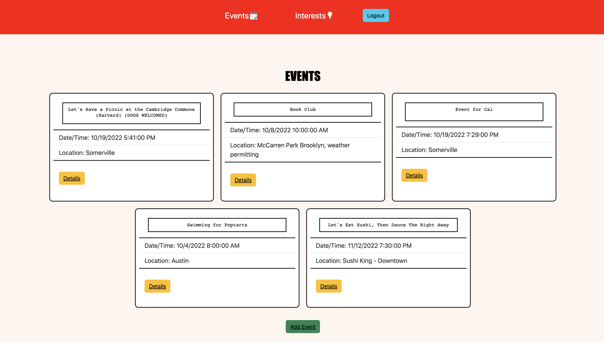

# Event-Planner!

Event Planner is an event planning website where people can create events for others to attend! Users will need to Login in order to fully use the website.

## Events

Once logged in, Users can create events by clicking the Add Event Button and providing necessary details like the Event Name, Details, Date/Time & Location. 

Once an event is created, Users can click on the details of the event and are presented with all the information provided by the event-planner. If a User is interested in coming to the the event, they can click the 'Attend' button. They can unattend by clicking the same button as well. Users can leave comments on each event asking questions or praise the event-planner for such a cool event. Whoever made the event has access to edit or delete their event

If the event planner clicks on the edit details button, they are given the same layout to change all the details of the event!

## Interests

There is an Interests page that Users can view. They can select any User that has logged in and see fun facts about every user!

The User can provide details about themselves regarding: Hobbies, Foods, Movies, and Other. That way people can know a bit about each User on the website!

## Plan An Event: [Event-Planner](https://eventplanner-rimoni.fly.dev/)

## Languages used 🗯

 * HTML
 * CSS
 * JavaScript
 * git

## BackEnd used 🔧

 * Node.js
 * Express
 * Mongoose
 * Middleware

## Credits:

Button Colors & Cards for 'Events' were utilized from Bootstrap.com, which is licensed by MIT - [link](https://getbootstrap.com/)

## Ice Box ❆

- [ ] Dark Mode
- [ ] Create Keywords so Users can find events easily
- [ ] Organize Events from closest too farthest date 
- [x] Font Design
- [x] Comment Section
- [x] Add a Favicon
- [x] Interest Page 